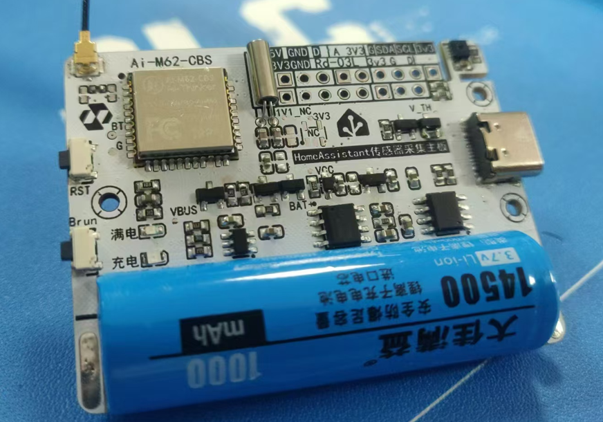
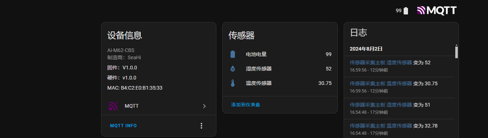

# 低功耗传感器采集主板



## 文件说明
```
├── hardware    ——>硬件相关
├── IMG         ——>图片文件夹
├── m62-sdk     ——>Ai-M62的SDK 
├── software    ——>软件文件夹
│   ├── Ai-mqtt-lib ——>安信可第三方库
│   │   ├── 3rdparty
│   │   ├── application
│   │   ├── driver
│   │   ├── protocol
│   │   ├── system
│   │   └── utils
│   ├── bin     ——>出厂固件文件夹
│   ├── ha_lp_sensor    ——>主要程序
│   │   ├── bl616dk     ——>2M flash 板配置文件
│   │   ├── components  ——>自定义组件，包含驱动和逻辑
│   │   ├── main        ——>主函数程序
│   │   └── systemConfig    ——>系统配置
│   └── HomeAssistant-lib   ——>HomeAssistant链接库
│       ├── docs        ——>链接库的使用说明
│       └── HomeAssistant-C ——>链接库源码
└── toolchain
```
## 克隆

### github
```
git clone --recursive  https://github.com/SeaHi-Mo/HA_LP_Sensor.git
```

### gitee
```
git clone --recursive  https://gitee.com/seahi007/HA_LP_Sensor.git
```
## 修改配置
HomeAssistant 链接库默认不开启Sensor 实体，如果不做修改的话，会出现编译错误:

- 打开[homeAssistantDevConfig.h](software/HomeAssistant-lib/HomeAssistant-C/homeAssistantDevConfig.h)
- 修改 文件中 122 行的 **#define CONFIG_ENTITY_ENABLE_SENSOR 0** 为 **#define CONFIG_ENTITY_ENABLE_SENSOR 1**


## 编译和烧录
### 命令行
进入到 ha_lp_sensor 文档,使用make 进行编译：
```
cd HA_LP_Sensor/software/ha_lp_sensor/
make
```
**烧录：**
```
make flash COMX=/dev/ttyUSBx
```
> `/dev/ttyUSBx` 是Linux 实际的USB端口号

### Windows 烧录工具

请先下载V1.0固件:[ha_lp_sensor_release_v1_0.bin](software/bin/ha_lp_sensor_release_v1_0.bin)
然后下载烧录工具:[点击下载](https://docs.ai-thinker.com/_media/bouffalolabdevcube-v1.9.0.zip)

解压并打开烧录工具,选择<kbd>BL616/618</kbb>:


## 配置网络

>注意，第一次烧录程序一定要给板子配网。

#### 配网流程：

1. 重复按复位键5次（每次间隔**1S左右**）
2. 网络指示灯闪烁之后就是配网状态
3. 打开微信小程序搜索 **<安信可IOT>**
4. 进入 **Blufi 配网** 界面点击 **扫描设备**
5. 找到一个名称：**M62-Sensor-xxxx** 的设备
6. 点击连接之后，输入WiFi名称密码
7. 点击**更多信息**，并选择**MQTT服务器**（只需要配置一次）
8. 输入 MQTT服务器地址和端口号（只需要配置一次）
9. 输入完成点击 **配置WiFi**
10. 等待网络指示灯长亮即可配网成功

## HomeAssistant 监控

